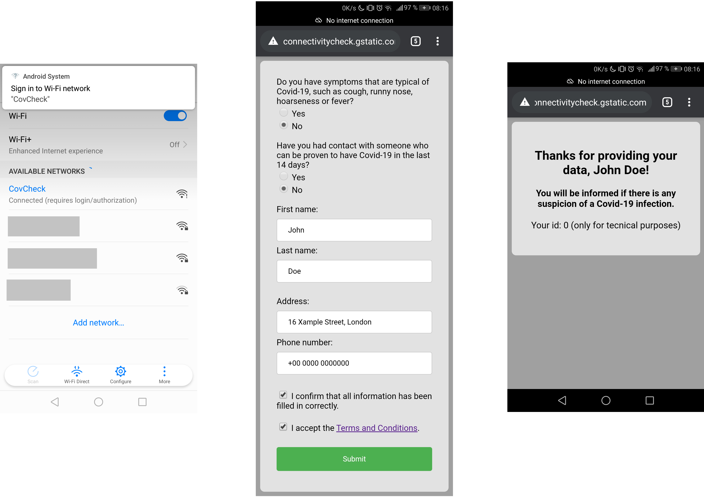
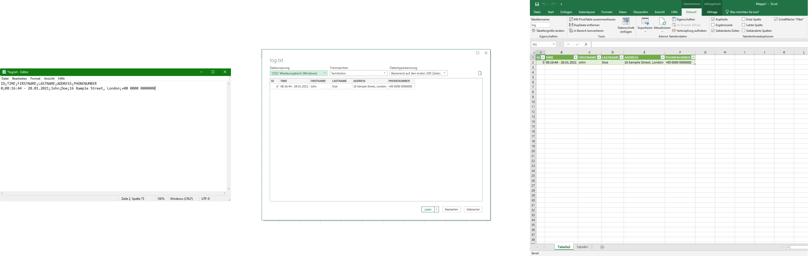

# 001_Covid-19_Guest_Registration-ESP8266_Captive_Portal

<h1>The project...</h1>

<h3>How does it work?</h3>

The code starts a Wi-Fi access point without a password on your ESP8266. You can print yourself a QR code containing the Wi-Fi connection information for this access point. Any device that is trying to connect to it will be redirected to a survey where the user has to enter some data. The data is saved after completing and the user will be redirected to a success page. The file with the collected data on an SD card can be accessed later on.

<h3>Is it safe to use?</h3>

Data security is very important here in Germany so I tried to build the whole thing as save as possible. Since it's not connected to the internet and there is no programmed possibility to read the saved data, it should be quite secure. But don’t take this too seriously! I'm pretty sure some intelligent people will find a way to hack it and get access to the data. I tried my best, but there is no warranty for safety.</h3>

<h3>Is there any purpose?</h3>

This project is made for fun and educational purposes with a touch of being useful in real-life situations ;). You can for example run this code on an ESP in your house entry and print some little QR codes your visitors can scan to be redirected to the registration. The code might also be useful for little public events if you want to be able to warn all guests in case of an outbreak scenario. It could also be used in public transport with maybe some added features like seat numbers that are part of the QR code (Wi-Fi password) and can be saved later. You could set up an ESP running this code in a restaurant to collect your guest’s data…

<h3>So why is there no one doing it this way?</h3>

That’s probably because of the Covid-19 apps which would be doing a great job if everybody would use them. You can play around with this project but make sure you still have installed the warn app.

<h1>The hardware...</h1>

The hardware I use consists of a WeMos D1 Mini Board with ESP8266 and a bootloader and a fitting shield featuring a micro-sd card slot as well as an RTC (DS1307). This is kind of an overkill for this project since the code could be modified to save the data on the built-in SPIFFS of the ESP266 and the time could (if needed) be pulled from a server on the internet. I decided on this setup anyway because it makes the whole thing very portable and easy to set up - You'll just have to power the device up and it will run (hopefully!). This setup does not require any connection to the internet.

<h1>The code...</h1>

I have to admit that there is hardly any documentation in the code. I will work on that...

<h1>How to use it?</h1>

You can just upload this code on your esp8266 using the Arduino IDE. You might have to install the libraries by the manager. If this is your first project using the ESP8266, you'll have to <a href="https://github.com/esp8266/Arduino#installing-with-boards-manager">install the boards manager</a> to upload your code. You have to upload the data folder to the SPIFFS of the ESP8266 using the upload tool you might have to <a href="https://github.com/esp8266/Arduino/blob/master/doc/filesystem.rst#uploading-files-to-file-system">install</a> if you haven't done jet. If you then connect to the network (for example by using  a QR code), it should look like this.

</img>

Once you collected some data, you can easily put the sd card in your pc and import the log.txt file to Excel in order to see all the entries.

</img>

<h1>License</h1>

MIT License  
Copyright (c) 2021 Dee Bugger  
Permission is hereby granted, free of charge, to any person obtaining a copy of this software and associated documentation files (the "Software"), to deal in the Software without restriction, including without limitation the rights to use, copy, modify, merge, publish, distribute, sublicense, and/or sell copies of the Software, and to permit persons to whom the Software is furnished to do so, subject to the following conditions:   
The above copyright notice and this permission notice shall be included in all copies or substantial portions of the Software.   
THE SOFTWARE IS PROVIDED "AS IS", WITHOUT WARRANTY OF ANY KIND, EXPRESS OR IMPLIED, INCLUDING BUT NOT LIMITED TO THE WARRANTIES OF MERCHANTABILITY, FITNESS FOR A PARTICULAR PURPOSE AND NONINFRINGEMENT. IN NO EVENT SHALL THE AUTHORS OR COPYRIGHT HOLDERS BE LIABLE FOR ANY CLAIM, DAMAGES OR OTHER LIABILITY, WHETHER IN AN ACTION OF CONTRACT, TORT OR OTHERWISE, ARISING FROM, OUT OF OR IN CONNECTION WITH THE SOFTWARE OR THE USE OR OTHER DEALINGS IN THE SOFTWARE.

Icon: CORONAVIRUS COVID19-SYMBOL | Designed by Vexels.com

